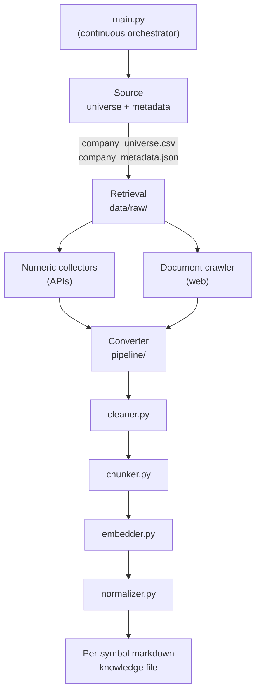

# Data Harvester

End-to-end pipeline for building per-company knowledge files from Indian equity market data. The system maintains a Nifty Midcap and Smallcap company universe, collects numeric and document data from multiple sources, and transforms everything into unified, source-linked markdown knowledge files.

**Last updated:** June 2026  
**Python:** 3.11+ (see `.python-version`)

---

## Architecture

The project architecture is finalized. All major folders, modules, interfaces, and pipeline stages exist. The current coding task is **not** to redesign anything, but to **populate the existing nodes with implementation** while respecting downstream dependencies.



Every implementation must be written with awareness of the **next stage** in the pipeline, ensuring:

- Strict compatibility between modules
- Deterministic outputs
- Resumability and incremental updates
- Structured logging
- Full end-to-end traceability from source collection to final markdown generation

---

## Pipeline stages

### 1. `main.py` — orchestrator

`main.py` is the continuous orchestrator entry point. It coordinates Source → Retrieval → Converter in order, manages run lifecycle, and is the single place to trigger full or partial pipeline runs.

**Status:** Complete — implements full pipeline orchestration with resumability, looping, and proper logging.

### 2. Source — company universe

The Source stage maintains the Nifty Midcap and Smallcap company universe. It periodically updates constituents and produces two canonical artifacts consumed by all downstream stages:

| Artifact | Path | Purpose |
|----------|------|---------|
| Company universe CSV | `config/company_universe.csv` | Symbol list and core metadata (~400 companies) |
| Company metadata JSON | `config/company_metadata.json` | Full company metadata and associated URLs |

**Implementation:**

| Component | Path | Status |
|-----------|------|--------|
| Universe builder | `scripts/build_universe.py` | Working |
| Live universe CSV | `config/company_universe.csv` | Working (~400 symbols) |
| Nifty constituent sources | `config/sources/*.csv` | Present |
| Metadata JSON generator | — | Not implemented |
| Periodic constituent refresh | — | Not implemented |

### 3. Retrieval — raw data collection

Retrieval consumes the Source universe and populates `data/raw/` through two collection paths.

#### Numeric path (`Retrieval/Numeric/`)

API-based collectors for structured financial data.

| Module | Status | Notes |
|--------|--------|-------|
| `base_numeric_collector.py` | Implemented | ABC + batch CSV/Parquet export path |
| `indiaapi_collector.py` | Working | Async historical prices → per-symbol JSON |
| `yfinance_collector.py` | Implemented | Updated to satisfy BaseNumericCollector contract |
| `nse_collector.py` | Implemented | Added skeleton implementation |
| `bsc_collector.py` | Implemented | Added skeleton implementation |
| `screener_collector.py` | Implemented | Added skeleton implementation |
| `registry.py` | Fixed | Updated import paths to point to correct modules |

**India API output layout:**

```
data/raw/
├── {SYMBOL}.json      # Per-symbol response envelope
├── manifest.json      # Run totals, timestamps, resume support
├── nse/               # Reserved for NSE document/raw data
└── bse/               # Reserved for BSE document/raw data
```

#### Document path (`Retrieval/Document/`)

Web crawler for unstructured company documents.

| Module | Status | Notes |
|--------|--------|-------|
| `company_crawler.py` | Implemented | Complete implementation with URL traversal, download, and metadata support |

The crawler visits every URL associated with each company (from `company_metadata.json`), discovers and downloads relevant documents — PDFs, HTML pages, ZIP files, presentations, reports, and other supported formats — while maintaining metadata and traceability back to the source URL and collection run.

**Dependencies:** `crawl4ai` (installed).

#### Transcripts (`Retrieval/transcript_collector.py`)

Placeholder for earnings call transcript collection.

### 4. Converter — processing chain (`pipeline/`)

Converter consumes raw data from `data/raw/` and executes the processing chain to transform both structured and unstructured information into a unified company knowledge representation.

| Stage | Module | Input | Output | Status |
|-------|--------|-------|--------|--------|
| Clean | `cleaner.py` | `data/raw/{symbol}/` | `data/cleaned/{symbol}/` | Complete |
| Chunk | `chunker.py` | cleaned data | `data/chunked/{symbol}/` | Complete |
| Embed | `embedder.py` | chunked data | embeddings | Complete |
| Normalize | `normalizer.py` | all prior stages | unified schema | Complete |
| Export | `exporter.py` | normalized data | final artifacts | Placeholder (planned) |

**Final output:** For each symbol, a complete markdown knowledge file containing all collected, cleaned, normalized, and source-linked information.

Each stage preserves provenance metadata (source URL, fetch timestamp, run ID, document type) so the final markdown can cite its origins.

---

## Implementation status at a glance

| Area | Status |
|------|--------|
| Company universe CSV | Working |
| Universe builder script | Working |
| `company_metadata.json` | Not started |
| `main.py` orchestrator | Complete |
| `IndiaAPICollector` | Working (sample runs) |
| `BaseNumericCollector` | Implemented (no child has completed full `run()`) |
| Document crawler | Complete |
| NSE / BSE / Screener / YFinance collectors | Complete |
| Converter chain (`pipeline/`) | Complete |
| Collector registry | Fixed (import paths updated) |
| Per-symbol markdown output | Not started |
| Tests | Minimal (`tests/test_yfinance_api_.py`) |

---

## Directory layout

```
data_harvester/
├── main.py                          # Continuous orchestrator (complete)
├── config/
│   ├── company_universe.csv         # Live universe (~400 symbols)
│   ├── company_universe.yaml        # Example/template only
│   ├── settings.py                  # Path constants
│   └── sources/                     # Nifty constituent CSVs
├── scripts/
│   └── build_universe.py            # Universe CSV builder
├── Retrieval/
│   ├── Numeric/
│   │   ├── base_numeric_collector.py
│   │   ├── indiaapi_collector.py    # Working async price collector
│   │   ├── yfinance_collector.py    # Complete implementation
│   │   ├── nse_collector.py         # Complete skeleton
│   │   ├── bsc_collector.py         # Complete skeleton  
│   │   └── screener_collector.py    # Complete skeleton
│   ├── Document/
│   │   └── company_crawler.py       # Complete crawler implementation
│   ├── transcript_collector.py      # Placeholder
│   └── registry.py                  # Fixed - import paths updated
├── pipeline/                        # Converter processing chain (complete)
│   ├── cleaner.py                   # Complete implementation
│   ├── chunker.py                   # Complete implementation
│   ├── embedder.py                  # Complete implementation
│   ├── normalizer.py                # Complete implementation
│   └── exporter.py                  # Placeholder (planned)
├── storage/
│   └── raw_store.py                 # Stale placeholder (old document model)
├── data/
│   ├── raw/                         # Raw collected data (gitignored)
│   ├── cleaned/                     # Post-cleaner output (gitignored)
│   ├── chunked/                     # Post-chunker output (gitignored)
│   └── exports/                     # Final exports (gitignored)
├── tests/
│   └── test_yfinance_api_.py
├── Doc/                             # Architecture notes and specs
└── pyproject.toml
```

---

## Setup

```bash
cd data_harvester
uv sync   # or: pip install -e .
```

**Dependencies:** `httpx`, `pandas`, `pyarrow`, `pyyaml`, `tenacity`, `yfinance`, `crawl4ai`.

---

## Running what works today

### India API collector

1. Set API key (do not commit; use `.env` locally):

   ```bash
   export INDIAN_API_KEY="your-key"
   # or
   export INDIA_API_KEY="your-key"
   ```

2. Run from project root:

   ```bash
   .venv/bin/python Retrieval/Numeric/indiaapi_collector.py
   ```

   | Flag | Purpose |
   |------|---------|
   | `--limit 10` | Test on first N symbols |
   | `--overwrite` | Re-fetch symbols that already have JSON files |
   | `--raw-dir data/raw` | Output directory |
   | `--rate-limit 3` | Seconds between HTTP requests (default 3) |
   | `--verbose` | Debug logging |

3. **Resume:** Re-run without `--overwrite` — existing `{SYMBOL}.json` files are skipped.

**Success envelope:**

```json
{
  "symbol": "360ONE",
  "endpoint": "historical_data",
  "period": "max",
  "filter": "price",
  "fetched_at": "2026-06-04T18:32:15.640435+00:00",
  "status_code": 200,
  "data": { }
}
```

**Manifest (`data/raw/manifest.json`):**

```json
{
  "total_companies": 400,
  "successful": 350,
  "failed": 50,
  "started_at": "...",
  "completed_at": "..."
}
```

### Generic `BaseNumericCollector` pipeline

No production-ready child uses the CSV/Parquet export path yet. Intended usage once a child implements all abstract methods:

```python
from Retrieval.Numeric.some_collector import SomeCollector

collector = SomeCollector()
collector.run()  # → data/cleaned/{source}/{source}_YYYYMMDD.csv|.parquet
```

Required on each child class: `SOURCE_NAME`, `BASE_URL`, `BATCH_SIZE`, `MAX_RETRIES`, `OUTPUT_COLUMNS`, plus `build_request`, `fetch_batch`, `parse_response`, `normalize_record`.

---

## Configuration

| Item | Location |
|------|----------|
| Universe CSV | `config/company_universe.csv` |
| Company metadata | `config/company_metadata.json` (target) |
| Raw data | `data/raw/` (gitignored) |
| Cleaned data | `data/cleaned/` (gitignored) |
| Chunked data | `data/chunked/` (gitignored) |
| Exports | `data/exports/` (gitignored) |
| API keys | Environment variables / local `.env` (gitignored) |

---

## Gitignored paths

See `.gitignore`: `.env`, `data/raw/`, `data/cleaned/`, `data/chunked/`, `data/exports/`, `.venv/`.

---

## Known issues / tech debt

1. **`company_universe.csv` header typo:** Column is `Syobol` (not `Symbol` / `ticker`). Collectors handle it via aliases; `build_universe.py` writes `ticker` when rebuilt.
2. **Stale import paths:** `Retrieval/registry.py`, `indiaapi_collector.py`, and `yfinance_collector.py` import from `collectors.*` — the module was moved to `Retrieval/Numeric/`.
3. **`registry.py`:** References non-existent collector classes — not safe to import until implemented and paths fixed.
4. **`yfinance_collector.py`:** Does not satisfy `BaseNumericCollector` contract.
5. **`storage/raw_store.py`:** Out of sync with current JSON-per-symbol and document crawler models.
6. **Two collector patterns:** Batch tabular (`BaseNumericCollector.run()`) vs per-symbol async JSON (`IndiaAPICollector.run_async()`). Unification TBD.
7. **`company_metadata.json`:** Required by document crawler and orchestrator; not yet generated by Source.
8. **Full universe harvest:** ~400 symbols × 3s ≈ 20+ minutes minimum; plan for rate limits and API quotas.

---

## Documentation references

| Document | Purpose |
|----------|---------|
| `Doc/cursor_prompt_base_collector.md` | Spec for `BaseNumericCollector` |
| `Doc/pipeline arch` | End-to-end pipeline flow notes |
| `Doc/Base Collector arch designe` | Collector responsibilities checklist |

---

## Implementation order (suggested)

Work downstream-aware: each node must produce output the next stage can consume without adaptation.

1. **Source** — Generate `company_metadata.json` with URLs; automate periodic universe refresh.
2. **Retrieval / Numeric** — Complete India API full-universe run; implement remaining API collectors.
3. **Retrieval / Document** — Implement `company_crawler.py` (URL traversal, download, metadata sidecars).
4. **Converter** — Implement `cleaner.py` → `chunker.py` → `embedder.py` → `normalizer.py` → `exporter.py`.
5. **Orchestrator** — Wire stages in `main.py` with run IDs, logging, resume, and incremental updates.
6. **Registry & tests** — Fix `Retrieval/registry.py`; add pytest coverage for universe parsing, batching, and response parsing.
